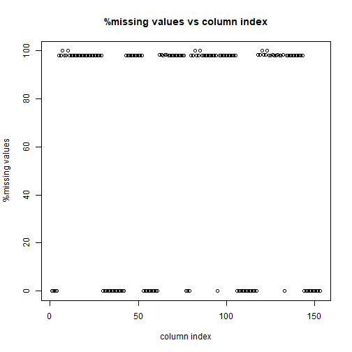
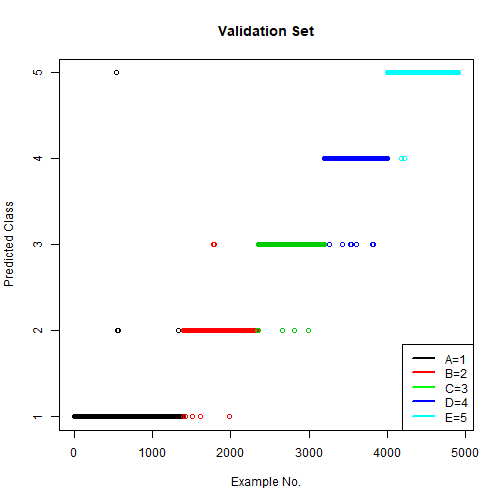

<!-- rmarkdown v1 -->


Exercise Manner Prediction Using Data from Accelerometers on the Belt, Forearm, Arm and Dumbbell of Participants
===========

## Synopsis

Using devices such as Jawbone Up, Nike FuelBand, and Fitbit it is now possible to collect a large amount of data about personal activity relatively inexpensively. These type of devices are part of the quantified self movement – a group of enthusiasts who take measurements about themselves regularly to improve their health, to find patterns in their behavior, or because they are tech geeks. One thing that people regularly do is quantify how much of a particular activity they do, but they rarely quantify how well they do it. In this project, we will be using data from accelerometers on the belt, forearm, arm, and dumbbell of 6 participants to predict the manner in which they did the exercise. They were asked to perform barbell lifts correctly and incorrectly in 5 different ways.

## Exploratory Data Analysis

We obtained the [Training Data](https://d396qusza40orc.cloudfront.net/predmachlearn/pml-training.csv) and the [Testing Data](https://d396qusza40orc.cloudfront.net/predmachlearn/pml-testing.csv) from the source[1] in the references section.

First, we load the required libraries for this analysis.


```r
library(dplyr)
library(caret)
library(parallel)
library(doParallel)
```

### Reading in the data

The data for this assignment is in the form of a comma-separated-value file (.csv). We download the data in raw form.


```r
if(!file.exists("./pml-training.csv"))
{
    download.file("https://d396qusza40orc.cloudfront.net/predmachlearn/pml-training.csv",
                  "./pml-training.csv")     
}

if(!file.exists("./pml-testing.csv"))
{
    download.file("https://d396qusza40orc.cloudfront.net/predmachlearn/pml-testing.csv",
                  "./pml-testing.csv")
    
}
```


Now, we read in the training data from the raw csv file. Then we look at the dimension of the training data and the name of the columns to find out the columns of interest.


```r
trdata <- data.table::fread("./pml-training.csv") %>%
    as_tibble 

dim(trdata); 
```

```
## [1] 19622   160
```

```r
names(trdata);
```

```
##   [1] "V1"                       "user_name"               
##   [3] "raw_timestamp_part_1"     "raw_timestamp_part_2"    
##   [5] "cvtd_timestamp"           "new_window"              
##   [7] "num_window"               "roll_belt"               
##   [9] "pitch_belt"               "yaw_belt"                
##  [11] "total_accel_belt"         "kurtosis_roll_belt"      
##  [13] "kurtosis_picth_belt"      "kurtosis_yaw_belt"       
##  [15] "skewness_roll_belt"       "skewness_roll_belt.1"    
##  [17] "skewness_yaw_belt"        "max_roll_belt"           
##  [19] "max_picth_belt"           "max_yaw_belt"            
##  [21] "min_roll_belt"            "min_pitch_belt"          
##  [23] "min_yaw_belt"             "amplitude_roll_belt"     
##  [25] "amplitude_pitch_belt"     "amplitude_yaw_belt"      
##  [27] "var_total_accel_belt"     "avg_roll_belt"           
##  [29] "stddev_roll_belt"         "var_roll_belt"           
##  [31] "avg_pitch_belt"           "stddev_pitch_belt"       
##  [33] "var_pitch_belt"           "avg_yaw_belt"            
##  [35] "stddev_yaw_belt"          "var_yaw_belt"            
##  [37] "gyros_belt_x"             "gyros_belt_y"            
##  [39] "gyros_belt_z"             "accel_belt_x"            
##  [41] "accel_belt_y"             "accel_belt_z"            
##  [43] "magnet_belt_x"            "magnet_belt_y"           
##  [45] "magnet_belt_z"            "roll_arm"                
##  [47] "pitch_arm"                "yaw_arm"                 
##  [49] "total_accel_arm"          "var_accel_arm"           
##  [51] "avg_roll_arm"             "stddev_roll_arm"         
##  [53] "var_roll_arm"             "avg_pitch_arm"           
##  [55] "stddev_pitch_arm"         "var_pitch_arm"           
##  [57] "avg_yaw_arm"              "stddev_yaw_arm"          
##  [59] "var_yaw_arm"              "gyros_arm_x"             
##  [61] "gyros_arm_y"              "gyros_arm_z"             
##  [63] "accel_arm_x"              "accel_arm_y"             
##  [65] "accel_arm_z"              "magnet_arm_x"            
##  [67] "magnet_arm_y"             "magnet_arm_z"            
##  [69] "kurtosis_roll_arm"        "kurtosis_picth_arm"      
##  [71] "kurtosis_yaw_arm"         "skewness_roll_arm"       
##  [73] "skewness_pitch_arm"       "skewness_yaw_arm"        
##  [75] "max_roll_arm"             "max_picth_arm"           
##  [77] "max_yaw_arm"              "min_roll_arm"            
##  [79] "min_pitch_arm"            "min_yaw_arm"             
##  [81] "amplitude_roll_arm"       "amplitude_pitch_arm"     
##  [83] "amplitude_yaw_arm"        "roll_dumbbell"           
##  [85] "pitch_dumbbell"           "yaw_dumbbell"            
##  [87] "kurtosis_roll_dumbbell"   "kurtosis_picth_dumbbell" 
##  [89] "kurtosis_yaw_dumbbell"    "skewness_roll_dumbbell"  
##  [91] "skewness_pitch_dumbbell"  "skewness_yaw_dumbbell"   
##  [93] "max_roll_dumbbell"        "max_picth_dumbbell"      
##  [95] "max_yaw_dumbbell"         "min_roll_dumbbell"       
##  [97] "min_pitch_dumbbell"       "min_yaw_dumbbell"        
##  [99] "amplitude_roll_dumbbell"  "amplitude_pitch_dumbbell"
## [101] "amplitude_yaw_dumbbell"   "total_accel_dumbbell"    
## [103] "var_accel_dumbbell"       "avg_roll_dumbbell"       
## [105] "stddev_roll_dumbbell"     "var_roll_dumbbell"       
## [107] "avg_pitch_dumbbell"       "stddev_pitch_dumbbell"   
## [109] "var_pitch_dumbbell"       "avg_yaw_dumbbell"        
## [111] "stddev_yaw_dumbbell"      "var_yaw_dumbbell"        
## [113] "gyros_dumbbell_x"         "gyros_dumbbell_y"        
## [115] "gyros_dumbbell_z"         "accel_dumbbell_x"        
## [117] "accel_dumbbell_y"         "accel_dumbbell_z"        
## [119] "magnet_dumbbell_x"        "magnet_dumbbell_y"       
## [121] "magnet_dumbbell_z"        "roll_forearm"            
## [123] "pitch_forearm"            "yaw_forearm"             
## [125] "kurtosis_roll_forearm"    "kurtosis_picth_forearm"  
## [127] "kurtosis_yaw_forearm"     "skewness_roll_forearm"   
## [129] "skewness_pitch_forearm"   "skewness_yaw_forearm"    
## [131] "max_roll_forearm"         "max_picth_forearm"       
## [133] "max_yaw_forearm"          "min_roll_forearm"        
## [135] "min_pitch_forearm"        "min_yaw_forearm"         
## [137] "amplitude_roll_forearm"   "amplitude_pitch_forearm" 
## [139] "amplitude_yaw_forearm"    "total_accel_forearm"     
## [141] "var_accel_forearm"        "avg_roll_forearm"        
## [143] "stddev_roll_forearm"      "var_roll_forearm"        
## [145] "avg_pitch_forearm"        "stddev_pitch_forearm"    
## [147] "var_pitch_forearm"        "avg_yaw_forearm"         
## [149] "stddev_yaw_forearm"       "var_yaw_forearm"         
## [151] "gyros_forearm_x"          "gyros_forearm_y"         
## [153] "gyros_forearm_z"          "accel_forearm_x"         
## [155] "accel_forearm_y"          "accel_forearm_z"         
## [157] "magnet_forearm_x"         "magnet_forearm_y"        
## [159] "magnet_forearm_z"         "classe"
```

As we can see, there are 19622 rows in the dataset with 160 columns. From those, we conclude that, for this analysis, our outcome column is ***classe***. The first 7 columns are most likely identifying variables for the participants, so we choose to discard those, keeping only the ***classe*** column and the columns containing in their names ***belt, forearm, arm, and dumbbell***. We also ensure that ***classe*** is a factor variable for further analyses.

### Selection of attributes


```r
trdata <- trdata %>% select(-c(V1:num_window)) %>%
    mutate(classe = factor(classe))
```


### Cleaning the data

We now calculate the percentage of missing values in the extracted training dataset.


```r
mean(is.na(trdata))
```

```
## [1] 0.6412377
```

The percentage of missing values in the training dataset is 64.1237693%, which unusually high. So, we examine the percentage of missing values in each column and find out a summary of the distribution.


```r
naPercent <- sapply(trdata, function(col) mean(is.na(col)))
plot(naPercent*100,
     xlab = "column index",
     ylab = "%missing values",
     main = "%missing values vs column index")
```



```r
summary(naPercent)
```

```
##    Min. 1st Qu.  Median    Mean 3rd Qu.    Max. 
##  0.0000  0.0000  0.9793  0.6412  0.9793  1.0000
```

As we can see, the median is ***0.9793089***, which suggests that at least half of our columns have more than ***97.9308939%*** missing values. The figure also suggests that the rest of the columns have near 0% missing values. We take this median value as cutoff value and discard all the columns that have ***more%*** missing values than this percentage.


```r
mdnNApt <- median(naPercent)
selectedCol <- (naPercent <= 1-mdnNApt)

trdata <- trdata %>%
    select_if(selectedCol)
```


Let's look at the dimensions of the extracted dataset.


```r
dim(trdata)
```

```
## [1] 19622    53
```

So, the number of columns has come down from 160 in the original dataset to 53.

## Training Partition

For model prediction, we first partition ***(3:1)*** our whole training dataset into two subsets: training and validation. We will build our model on the training set and evaluate performance on the validation set.


```r
set.seed(911)
inTrain <- createDataPartition(trdata$classe, p = 3/4, list = FALSE)
training <- trdata[ inTrain,]
validation <- trdata[-inTrain,]
```

Before we begin training, let's look at the dimensions of the training and validation sets.


```r
dim(training)
```

```
## [1] 14718    53
```

```r
dim(validation)
```

```
## [1] 4904   53
```


## Building Prediction Models

For our models, we will use a 3-fold cross-validation to ensure better performance. We will also use parallel processing to speed up training.  

### Model 1: Decision Tree
 
As our outcome variable is categorical, we will first build a simple Decision Tree classifier. We then look its performance on the training set itself.


```r
cluster <- makeCluster(detectCores()-1)
registerDoParallel(cluster)

set.seed(911)
modelDT <- train(classe~., data = training, method = "rpart", 
                 trControl = trainControl(method = "cv", number = 3,
                                          allowParallel = TRUE))

stopCluster(cluster)
registerDoSEQ()

print(modelDT)
```

```
## CART 
## 
## 14718 samples
##    52 predictor
##     5 classes: 'A', 'B', 'C', 'D', 'E' 
## 
## No pre-processing
## Resampling: Cross-Validated (3 fold) 
## Summary of sample sizes: 9812, 9812, 9812 
## Resampling results across tuning parameters:
## 
##   cp          Accuracy   Kappa    
##   0.03379854  0.4988450  0.3556277
##   0.06028672  0.3660823  0.1243948
##   0.11421248  0.3380894  0.0817684
## 
## Accuracy was used to select the optimal model using the largest value.
## The final value used for the model was cp = 0.03379854.
```

```r
confDTtr <- confusionMatrix(predict(modelDT, training), training$classe)
print(confDTtr)
```

```
## Confusion Matrix and Statistics
## 
##           Reference
## Prediction    A    B    C    D    E
##          A 3815 1160 1191 1065  397
##          B   56  976   85  428  371
##          C  306  712 1291  919  727
##          D    0    0    0    0    0
##          E    8    0    0    0 1211
## 
## Overall Statistics
##                                           
##                Accuracy : 0.4955          
##                  95% CI : (0.4874, 0.5036)
##     No Information Rate : 0.2843          
##     P-Value [Acc > NIR] : < 2.2e-16       
##                                           
##                   Kappa : 0.3408          
##                                           
##  Mcnemar's Test P-Value : NA              
## 
## Statistics by Class:
## 
##                      Class: A Class: B Class: C Class: D Class: E
## Sensitivity            0.9116  0.34270  0.50292   0.0000  0.44752
## Specificity            0.6380  0.92081  0.78076   1.0000  0.99933
## Pos Pred Value         0.5001  0.50939  0.32642      NaN  0.99344
## Neg Pred Value         0.9478  0.85377  0.88145   0.8361  0.88925
## Prevalence             0.2843  0.19350  0.17441   0.1639  0.18386
## Detection Rate         0.2592  0.06631  0.08772   0.0000  0.08228
## Detection Prevalence   0.5183  0.13018  0.26872   0.0000  0.08282
## Balanced Accuracy      0.7748  0.63175  0.64184   0.5000  0.72343
```

As we can see, the overall accuracy is 49.55% which means the in-sample error is 50.45%. It is very high, indicating there is high bias in our model. So, we decide to discard this model and build a better model.


### Model 2: Random Forest

Now, we build a Random Forest classifier. As earlier, we use 3-fold cross validation and parallel processing. We then look its performance on the training set itself.


```r
cluster <- makeCluster(detectCores()-1)
registerDoParallel(cluster)

set.seed(911)
modelRF <- train(classe~., data = training, method = "rf", verbose = FALSE, 
             trControl = trainControl(method = "cv", number = 3,
             allowParallel = TRUE))

stopCluster(cluster)
registerDoSEQ()

print(modelRF)
```

```
## Random Forest 
## 
## 14718 samples
##    52 predictor
##     5 classes: 'A', 'B', 'C', 'D', 'E' 
## 
## No pre-processing
## Resampling: Cross-Validated (3 fold) 
## Summary of sample sizes: 9812, 9812, 9812 
## Resampling results across tuning parameters:
## 
##   mtry  Accuracy   Kappa    
##    2    0.9902840  0.9877086
##   27    0.9881777  0.9850429
##   52    0.9805680  0.9754154
## 
## Accuracy was used to select the optimal model using the largest value.
## The final value used for the model was mtry = 2.
```

```r
confRFtr <- confusionMatrix(predict(modelRF, training), training$classe)
print(confRFtr)
```

```
## Confusion Matrix and Statistics
## 
##           Reference
## Prediction    A    B    C    D    E
##          A 4185    0    0    0    0
##          B    0 2848    0    0    0
##          C    0    0 2567    0    0
##          D    0    0    0 2412    0
##          E    0    0    0    0 2706
## 
## Overall Statistics
##                                      
##                Accuracy : 1          
##                  95% CI : (0.9997, 1)
##     No Information Rate : 0.2843     
##     P-Value [Acc > NIR] : < 2.2e-16  
##                                      
##                   Kappa : 1          
##                                      
##  Mcnemar's Test P-Value : NA         
## 
## Statistics by Class:
## 
##                      Class: A Class: B Class: C Class: D Class: E
## Sensitivity            1.0000   1.0000   1.0000   1.0000   1.0000
## Specificity            1.0000   1.0000   1.0000   1.0000   1.0000
## Pos Pred Value         1.0000   1.0000   1.0000   1.0000   1.0000
## Neg Pred Value         1.0000   1.0000   1.0000   1.0000   1.0000
## Prevalence             0.2843   0.1935   0.1744   0.1639   0.1839
## Detection Rate         0.2843   0.1935   0.1744   0.1639   0.1839
## Detection Prevalence   0.2843   0.1935   0.1744   0.1639   0.1839
## Balanced Accuracy      1.0000   1.0000   1.0000   1.0000   1.0000
```

As we can see, the overall accuracy is 100% which means the in-sample error is 0%. So, there is low bias(actually, no bias) in our model. But, this may be due to overfitting. Let's evaluate this model on the validation set to see how much variance there is.


```r
confRFval <- confusionMatrix(predict(modelRF, newdata=validation), validation$classe)
print(confRFval)
```

```
## Confusion Matrix and Statistics
## 
##           Reference
## Prediction    A    B    C    D    E
##          A 1390    8    0    0    0
##          B    4  938   15    0    0
##          C    0    3  840   11    0
##          D    0    0    0  793    3
##          E    1    0    0    0  898
## 
## Overall Statistics
##                                           
##                Accuracy : 0.9908          
##                  95% CI : (0.9877, 0.9933)
##     No Information Rate : 0.2845          
##     P-Value [Acc > NIR] : < 2.2e-16       
##                                           
##                   Kappa : 0.9884          
##                                           
##  Mcnemar's Test P-Value : NA              
## 
## Statistics by Class:
## 
##                      Class: A Class: B Class: C Class: D Class: E
## Sensitivity            0.9964   0.9884   0.9825   0.9863   0.9967
## Specificity            0.9977   0.9952   0.9965   0.9993   0.9998
## Pos Pred Value         0.9943   0.9801   0.9836   0.9962   0.9989
## Neg Pred Value         0.9986   0.9972   0.9963   0.9973   0.9993
## Prevalence             0.2845   0.1935   0.1743   0.1639   0.1837
## Detection Rate         0.2834   0.1913   0.1713   0.1617   0.1831
## Detection Prevalence   0.2851   0.1951   0.1741   0.1623   0.1833
## Balanced Accuracy      0.9971   0.9918   0.9895   0.9928   0.9982
```

As we can see, the overall accuracy is 99.08% which means the expected out of sample error is 0.92%. It is very low, indicating there is also low variance in our model. As our RF model is showing both low bias and low variance, we decide on this model to be the final model.

Let's have a visual representation of our model's predictions on the validation set to see which examples it got wrong.


```r
plot(1:dim(validation)[1], 
     predict(modelRF, newdata=validation), 
     col = validation$classe,
     xlab = "Example No.",
     ylab = "Predicted Class",
     main = "Validation Set")
legend("bottomright", legend = c("A=1", "B=2", "C=3", "D=4", "E=5"), 
       col = c("black", "red", "green", "blue", "cyan"), lw = 2)
```




## Evaluation on the Test Dataset

We now load the testing dataset and perform similar transformations (as we did to our training set) on it first and then apply our RF model to the extracted set.


```r
tsdata <- data.table::fread("./pml-testing.csv") %>%
    as_tibble %>% select(-c(V1:num_window)) %>%
    select_if(selectedCol)

dim(tsdata)
```

```
## [1] 20 53
```

```r
testing <- tsdata

predRFtest <- predict(modelRF, newdata=testing)
print(predRFtest)
```

```
##  [1] B A B A A E D B A A B C B A E E A B B B
## Levels: A B C D E
```


## References

[1]: Source <http://web.archive.org/web/20161224072740/http:/groupware.les.inf.puc-rio.br/har>


